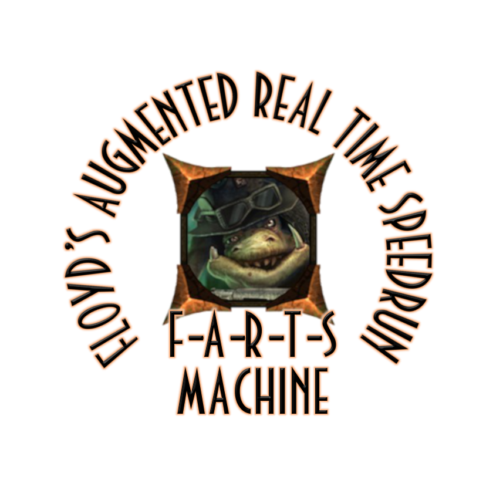

**F**loyd's **A**ugmented **R**eal **T**ime **S**peedrun Machine (F.A.R.T.S.-Machine) is a tool to make Oddworld: Stranger's Wrath HD speedruns a little more fun. The built-in "physics randomizer" keeps changing the run in random and funny ways.
The machine was explicitly built to give experienced speedrunners a new experience and extend the fun of the game and the speedrun. There are also three options built in that can be manually activated to find new strategies and ways to run.

## Compatibility
The F.A.R.T.S.-Machine was developed on Windows 10 and is designed for the Steam version of Oddworld: Stranger's Wrath HD. Other systems and combinations may experience problems running the tool.

## How to use
For a detailed video tutorial on how to use the F.A.R.T.S.-Machine see the YT video here:

=> https://www.youtube.com/watch?v=XRKB639nTPE&ab_channel=HuhnerSpeed

The basic steps are as follows:
1. Download the Release.zip file and extract it to a location of your choice
2. Open the 'FARTS-Machine.exe'
3. Open Stranger's Wrath HD
4. Click 'Attach to Game' - The tool should now indicate that the action was successful. If not, check if Stranger's Wrath HD is running and if the F.A.R.T.S.-Machine is running in administrator mode.
5. Start the randomizer by clicking 'Start Randomizer (0)' or by hitting the '0' button on your keyboard.

## Randomizer flow
Once the randomizer is started, it will wait for 10 seconds before activating one of the effects listed below.
After the effect is finished, another 10 seconds are waited until the next one is randomly selected and activated.

## List of effects
The F.A.R.T.S.-Machine randomizer can activate the following effects:

    1. No Damage (20 seconds)
    2. Stamina Freeze (20 seconds)
    3. Infinite Ammo (20 seconds)
    4. Remove 100 Health (instantly)
    5. Sudden Death (health will get set to 1, instantly)
    6. Heal Stranger (instantly)
    7. Remove Stamina (instantly)
    8. Refill Stamina (instantly)
    9. Sensitive 3rd Person Camera (40 seconds)
    10. Bird's Eye Camera (40 seconds)
    11. No 3rd Person Camera Control (40 seconds)
    12. No Jumping (40 seconds)
    13. No Floor Collision (5 seconds)
    14. Instant Bounty (30 seconds)
    15. Reduce Ammo to 1 (40 seconds)
    16. Lose Control over Stranger (10 seconds)
    17. No 3rd Person Movement (40 seconds)
    18. Micro Jump (40 seconds)
    19. Lock Camera (40 seconds)
    20. Super Jump (40 seconds)
    21. Kill Stranger (instantly)
    22. Freeze Stranger (15 seconds)
    23. No 1st Person Movement (40 seconds)
    24. Invincible Stranger (40 seconds)

## Known issues
- Effects that affect health do not work as expected at every point in the game
- If an effect is still active after the randomizer has ended or the F.A.R.T.S.-Machine has closed, the game should be restarted
- Effects may not work in the tutorial section of the game
